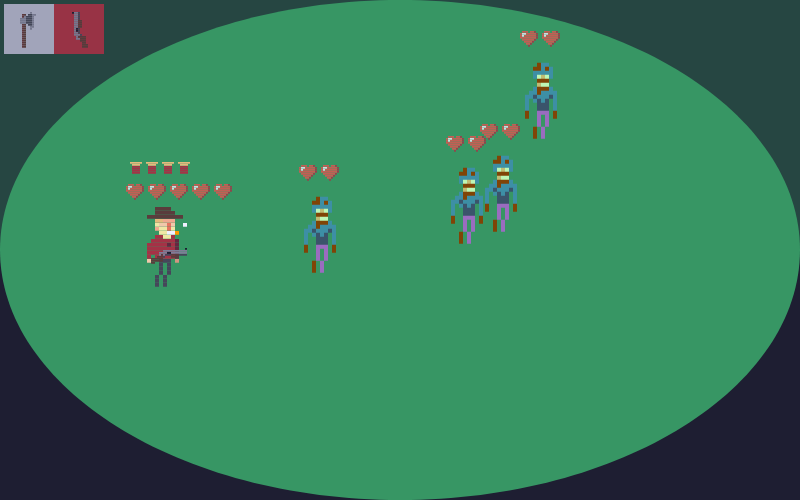

# WOODS
> A DOM based game

Try game [here](https://seapvnk.github.io/woods/)

<p align="center">
   
</p>

## Tutorial
Use WASD keys to movement character,
QE keys to switch weapeons
and click with in direction you want to attack

````
MOVEMENT PLAYER
   [W]
[A][S][D]

SWITCH WEAPEONS
[Q]  [E]

ATTACK
MOUSE LEFT -> Attack
click in direction you want to attack
````

## Motivation
This game is quite simple and has no history, it's very straightforward in it's gameplay. But approach used to build this game is unconventional. It uses DOM elements to render game entities.

The motivation behind the use of this technic is to put in prove my abilities in DOM manipulation and also because it's fun.
 
